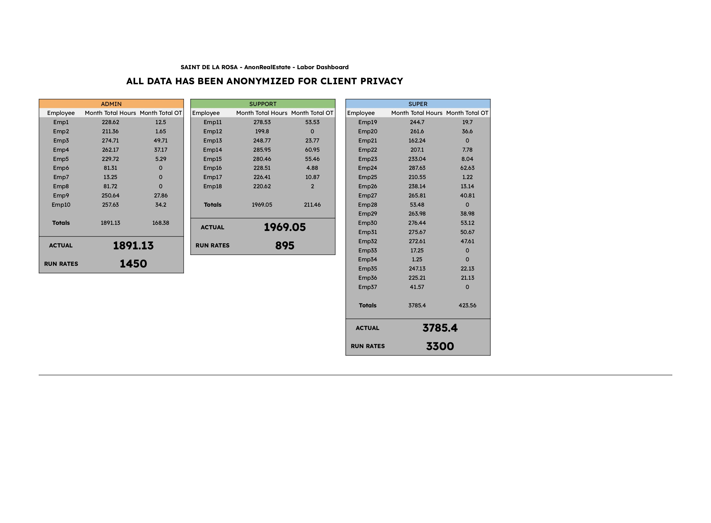

# 🏢 NYC Real Estate Cost Dashboards

**Client:** Anonymized NYC Real Estate Firm (Confidential Client)

**Role:** Operations Assistant at Ops Made Simple

**Tools Used:** Google Sheets, Asana

## 📌 Project Overview

This project supported a real estate firm managing 34 NYC residential buildings. The goal was to centralize operational cost data vendor expenses, labor hours, and building-level costs into clear dashboards for improved budgeting and decision-making.

---

## 📊 Dashboards (Previews Below)

### 1. Cost Per Building

Designed and implemented an interactive dashboard (visualized in Google Sheets) to provide a clear, property-level view of expenditures. This allowed the firm to quickly identify which buildings had higher or lower costs and to compare spending year-over-year. This dashboard primarily focused on:
* Total Renovation Cost vs. Building
* Overall Cost per Building (2024 vs. 2023)
* A summary of total costs and job counts for categories like "Turnover Plaster & Paint," "Repairs," and "Renovation."

📎 [Download PDF](./1.%20CostPerBuilding.pdf)

---

### 2. Small Vendor Dashboard

Developed a specialized dashboard to track and visualize expenditures by individual external service provider. This tool enabled the firm to identify high-cost providers, assess the effectiveness of their services, and inform negotiation strategies with external partners. This dashboard included:
* Cost per Vendor (total spending per external service provider).
* Combined Vendor Cost per Building (total spending per building from small vendors).
* Detailed cost categorization by "Preventative Maintenance," "Repair," "Supply," and "Misc" both in overall totals and monthly breakdowns.

📎 [Download PDF](./2.%20Small%20Vendor%20Dash.pdf)

---

### 3. Labor Dashboard

Created a detailed worksheet (as part of a dashboard structure) to monitor internal workforce expenses, including monthly total hours and overtime hours for Admin, Support, and Super (Superintendent) staff. This provided granular insights into labor allocation and potential areas for optimization across different departments and employees.

📎 [Download PDF](./3.%20Labor%20Dash.pdf)

---

## 🚀 Results

* **Drove Strategic Acquisition:** Crucially, the insights derived from these dashboards, particularly those focusing on external service provider costs and performance, directly influenced the firm's strategic decision-making. By highlighting clear cost structures and performance of specific external service providers, the firm opted to acquire a key external service provider and merge it into the company's internal operations, representing a significant long-term strategic move and cost-saving initiative.
* **Enhanced Financial Visibility:** The dashboards provided the firm with unprecedented clarity into their operational spending, allowing for a consolidated view of both external service provider and labor costs across their entire portfolio.
* **Identified Cost Optimization Opportunities:** By visualizing cost trends per building and per external service provider (including the detailed category breakdowns in the Small Vendor Dashboard), the firm gained the ability to pinpoint areas of overspending or inefficiency. For instance, the labor analysis highlighted monthly total hours and overtime, prompting evaluations for better workforce management.
* **Improved External Service Provider Management:** The Small Vendor Dashboard, with its detailed cost per vendor and category breakdowns, enabled data-driven negotiations with providers, potentially leading to cost savings and more efficient resource allocation.
* **Streamlined Decision-Making:** Access to organized, real-time cost data empowered the firm's management to make quicker, more informed decisions regarding budgeting, resource deployment, and operational strategy.
* **Reduced Manual Reporting:** The automated dashboards significantly reduced the time previously spent on manually compiling cost reports, freeing up valuable time for strategic analysis.

This project transformed raw operational data into tangible business intelligence, directly supporting the firm's objective of achieving greater financial control and operational efficiency across its diverse real estate portfolio, culminating in a major strategic acquisition based on data-driven insights.

---

> 🛡️ All data has been anonymized. No confidential or proprietary information is shared.
